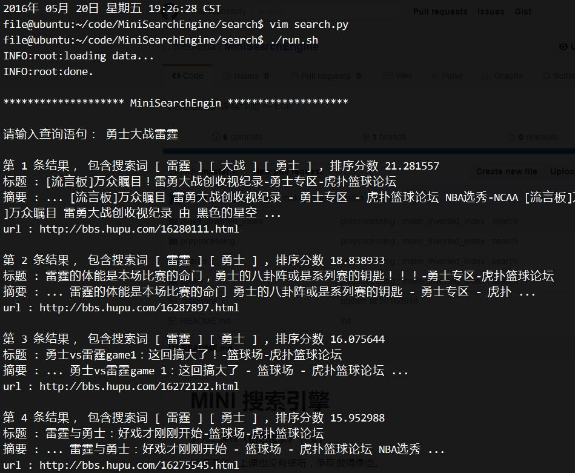

# MINI 搜索引擎

研究生课程《**信息检索**》 作业。

### 框架说明

见[PDF](README.pdf)

### 截图

### 问题

1. 如何生成摘要？如何利用位置信息来排序
  
  其实问题都是一个：设一个文档中包含K个单词，每个单词出现的位置信息是一个递增序列。
  
  求， 包含这这K个单词且总长度最小的区间是多少？

  实在不够聪明，没有想到什么好的办法。暴力求取的明确思路也没有。
  
  如果有人有想法，可以提Issues.
  
  == update ==
  
  刷了下算法，应该可以相对容易的建模为在一个字符串中包含一个模式字符序列的最小长度对应的子串。用Hash应该就能搞定吧。
